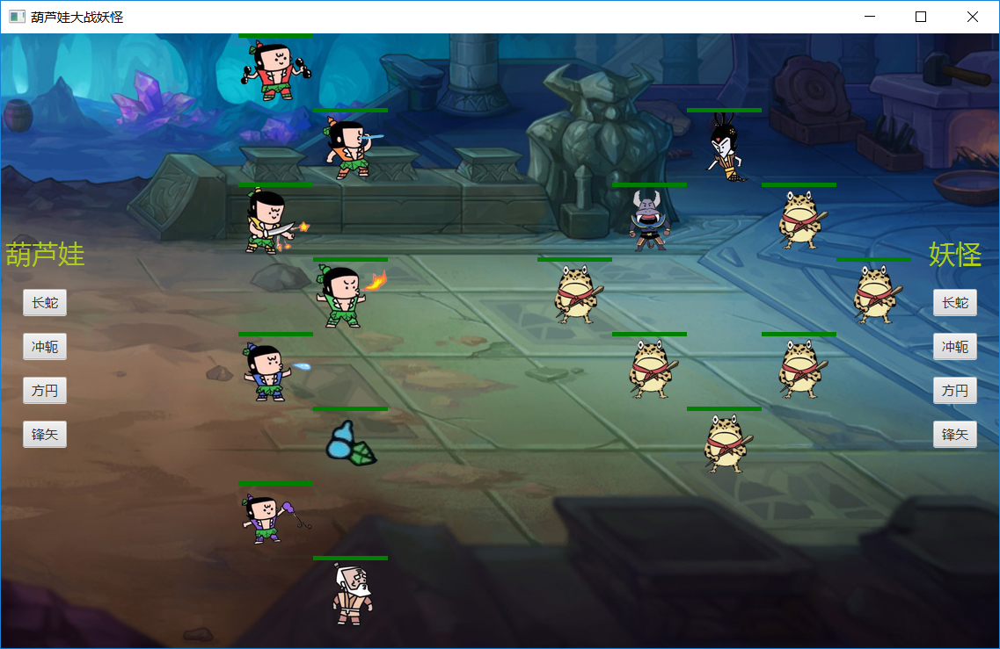

# 葫芦娃大战妖怪
## 运行效果

## 使用说明
执行`mvn clean test package`命令，打包的jar文件可在target目录下获得。程序界面的左右两边分别可以通过点击按钮设置葫芦娃和妖怪的阵形。按下`空格`键后，开始对战，生成的`.log`文件可在jar文件的同目录下找到。<br>
对战开始前或结束后，按下`L`键，可以选择log进行对战的回放。
## 游戏设定
游戏发生在一个8*11大小的二维空间。葫芦娃和妖怪每次可以朝上、下、左、右前进2格，由于走路需要消耗体力，所以它们走完以后要休息一段时间才能战斗。<br>
休息完成后，葫芦娃和妖怪会查看它们周围2格内是否有敌人存在，如果有，则攻击它们。当战场上只剩下一方生物时，游戏结束。
## 相关类说明
### package creature
抽象类`Creature`：是所有生物的基类，并且实现了`Runnable`接口，即每个生物都是一个线程。因为每个生物的移动方式都是相同的，所以实现了`move`方法。又因为葫芦娃和妖怪的攻击方式略有不同，所以只实现了一个空的方法`attack`。<br>
抽象类`Good`：继承了`Creature`，是所有正义生物的基类。重写了攻击邪恶生物的`attack`方法。<br>
抽象类`Bad`：是所有邪恶生物的基类。重写了攻击正义生物的`attack`方法。<br>
类`Red`，`Yellow`等和`Grandpa`：代表七个葫芦娃和爷爷，继承了`Good`，在构造器中指明了它们的生命值和攻击力。<br>
类`Snake`，`Scorpion`，`Loluo`：代表蛇精、蝎子精和喽啰，继承了`Bad`，在构造器中指明了它们的生命值和攻击力。<br>
### package space
`Block`：战场的最小单元。<br>
`BattleField`：表示战场，拥有成员变量`blocks` —— `Block`类的8*11的二维数组。<br>
`World`：战斗世界，成员变量有战场和战场上的生物。
### package queue
实现了各种阵形。
### package gui
包括图形界面的绘制和与用户的交互事件的处理。
## 关于多线程
### 线程安全
每个生物在移动和攻击时都要知道战场的实时情况，所以`Creature`类中有`BattleField`类的成员bf。移动和攻击的操作都会对战场进行更改。显然如果多个生物同时对战场进行更改，很可能会出现多个生物走到同一个格子上的情况。所以对bf上锁，同一时间只能有一个生物更改战场信息。
```java
protected void move() {
    ......
    synchronized (bf) {
        ...... // 进行移动并在bf的对应位置setCreature与eraseCreature
    }
    try {
        TimeUnit.MILLISECONDS.sleep(2000);  // 移动完休息一下
    } catch (InterruptedException e) {
        System.out.println("interrupted");
    }
}
```
attack方法与之类似。
### 线程的启动
捕获到不在回放状态的空格事件时，调用`World`类中的start。
```java
public void start() {
    // 绘图线程
    ExecutorService draw = Executors.newSingleThreadExecutor();
        draw.execute(new Painter(battleField, canvas));
    // 生物线程池
    ExecutorService exec = Executors.newCachedThreadPool();
    // 将生物添加至线程池并启动
    for (int i = 0; i < goods.size(); i++)
        exec.execute(goods.get(i));
    for (int i = 0; i < bads.size(); i++)
        exec.execute(bads.get(i));
    draw.shutdown();
    exec.shutdown();
}
```
## 关于面向对象
- 继承：`Creature`是所有生物的基类。
- 多态：在需要对生物进行操作的地方，使用的都是`Creature`类的参数，具体是哪种生物在运行时动态绑定。
- 组合模式：`World`类中包含了`BattleField`类和`Creature`类的对象，它们是战斗世界的一部分。
- 里氏替换原则：任何基类可以出现的地方，子类一定可以出现。 LSP是继承复用的基石，只有当衍生类可以替换掉基类，软件单位的功能不受到影响时，基类才能真正被复用。基类`Good`和`Bad`的子类没有重写基类中的方法。
- 接口隔离原则：每个接口中不存在子类用不到却必须实现的方法。接口`ZhenFa`中只有一个对葫芦娃进行排列的方法，这是每个阵形都会实现的。

